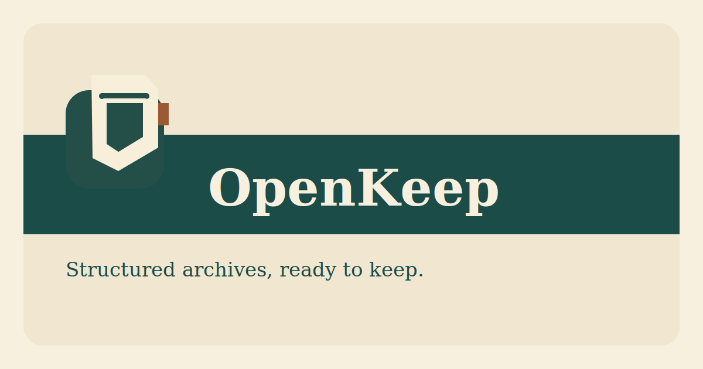

  

  <strong>Self-hosted archive intelligence for structured documents, review workflows, and search.</strong>

  

## Overview

OpenKeep is a self-hosted, AI-assisted document archive built as a TypeScript monorepo. The current implementation includes a NestJS API, async processing worker, PostgreSQL plus pgvector, object storage integration, a provider-driven document parsing platform, deterministic archive extraction, chunk persistence, chunk-level embeddings, grounded document Q&A, archive governance flows, and a connected web client on top of the backend APIs.

## License

OpenKeep is licensed under `PolyForm Noncommercial 1.0.0`.

- personal and other noncommercial use is allowed for free
- commercial use requires a separate commercial license
- see `LICENSE` for the full terms

For commercial licensing, contact the project owner before using OpenKeep in a commercial product, service, or internal business offering.

## Documentation

- User documentation: `docs/user/getting-started.md`
- Technical documentation: `docs/technical/README.md`
- Operational documentation: `docs/operations/README.md`
- Documentation hub: `docs/README.md`
- Docusaurus site app: `apps/docs`
- Current backend notes: `docs/backend.md`

The canonical markdown source remains in the root `docs/` directory. `apps/docs` is the site renderer layer.

## Workspace Layout

- `apps/api`: NestJS REST API with auth, document upload, search, and archive metadata APIs.
- `apps/worker`: background processing worker for OCR and metadata extraction jobs.
- `apps/web`: TanStack Router web client for search, review, document detail, admin settings, and archive operations.
- `apps/mobile`: React Native mobile client.
- `apps/desktop`: reserved placeholder for the future Electron client.
- `packages/config`: shared environment parsing and provider configuration.
- `packages/db`: Drizzle schema and migrations.
- `packages/types`: shared Zod schemas and public API types.
- `packages/sdk`: generated API client package consumed by the web app.

## Backend Capabilities

- Single-user owner auth with JWT access/refresh tokens and long-lived API tokens.
- `POST /api/documents` multipart upload with content-hash deduplication for stored binaries.
- Async processing via `pg-boss`.
- Provider-driven parsing pipeline with one globally active parse provider and optional fallback provider.
- Local-first OCR pipeline with normalization for scanned PDFs, TIFF, HEIC/HEIF, and direct raster uploads.
- Cloud parse adapters for Google Cloud Document AI Enterprise OCR, Google Cloud Document AI Gemini layout parser, Amazon Textract, Azure AI Document Intelligence, and Mistral OCR.
- Deterministic metadata extraction with shared normalization for correspondents, invoice dates, due dates, amounts, currencies, reference numbers, document types, and tags.
- Persisted document chunks generated from normalized parse output.
- Embedding-provider registry with OpenAI, Gemini, Voyage, and Mistral adapters.
- Chunk-level embedding storage in PostgreSQL via pgvector-compatible `halfvec`.
- `POST /api/search/semantic` hybrid search combining structured filters, PostgreSQL full-text search, and vector similarity.
- `POST /api/search/answer` grounded archive Q&A with chunk-level citations and insufficient-evidence fallback.
- Manual embedding reindex flows through `POST /api/embeddings/reindex` and `POST /api/documents/:id/reembed`.
- Explicit review workflow with `reviewStatus`, `reviewReasons`, structured review evidence, resolve/requeue endpoints, and latest processing-job summaries on documents.
- Manual override persistence for key metadata fields so user corrections survive reprocessing.
- Document history and audit APIs for upload, review, reprocess, reembed, and metadata changes.
- Taxonomy CRUD and merge flows for tags, correspondents, and document types.
- Archive export/import plus watch-folder scan ingestion endpoints.
- Retry-aware processing with bounded `pg-boss` backoff, structured JSON worker logs, and searchable-PDF artifact storage.
- PostgreSQL full-text search plus structured filters for year, dates, status, correspondent, document type, and tags.
- Virtual archive browsing via facet endpoints instead of a real nested folder tree.
- Ops endpoints for liveness, readiness, Prometheus-style metrics, and a dedicated searchable-PDF download route.
- Web admin surfaces for answer search, document history, manual overrides, taxonomies, and archive operations.

## Local Development

1. Copy `.env.example` to `.env` and replace the JWT secrets and owner password.
2. Install dependencies with `pnpm install`.
3. Apply database migrations with `pnpm db:migrate`.
4. Start infrastructure with `docker compose up postgres minio`.
5. Run the API with `pnpm --filter @openkeep/api dev`.
6. Run the worker with `pnpm --filter @openkeep/worker dev`.
7. Run the web app with `pnpm --filter @openkeep/web dev`.
8. Run the docs site with `pnpm docs:dev` if you want the Docusaurus experience locally.
9. Wait for `GET /api/health/ready` to report all checks green before using the stack.

If you want the full containerized stack, use `pnpm docker:up` or `pnpm docker:up:build`. Those wrappers auto-build the shared `worker-base` OCR image if it is missing locally, then start the usual compose stack on `http://localhost:3000`, docs on `http://localhost:3001`, and Typesense on `http://localhost:8108`.

Local secret hygiene:

- keep real credentials only in untracked local env files such as `.env`
- the Docker build context excludes `.env*` by default, while still allowing tracked `*.example` templates into images where needed
- if real credentials were ever present in local `.env` before this protection was added, rotate them before publishing images or the repository

Optional docs-site search:

- set `TYPESENSE_COLLECTION_NAME` and `TYPESENSE_ADMIN_API_KEY` in `.env`
- replace the default `TYPESENSE_ADMIN_API_KEY` before exposing the stack beyond local development
- set `TYPESENSE_PUBLIC_HOST`, `TYPESENSE_PUBLIC_PORT`, and `TYPESENSE_PUBLIC_PROTOCOL` to the browser-reachable Typesense address that the docs UI should query
- start the docs search stack with `pnpm docs:search:up`
- index the docs content with `pnpm docs:search:index`
- repeated `pnpm docs:search:index` runs automatically clear the current alias first to avoid a known synonym-transfer bug in `typesense/docsearch-scraper`
- the bootstrap step creates a search-only API key automatically and injects it into the docs container before Docusaurus builds
- override `DOCSEARCH_START_URL`, `DOCSEARCH_SITEMAP_URL`, and `DOCSEARCH_STOP_URL` if you want the scraper to target a different docs URL than the compose-hosted site

For local-only parsing, keep `ACTIVE_PARSE_PROVIDER=local-ocr`. To switch to a cloud adapter, set `ACTIVE_PARSE_PROVIDER` to one of the supported provider ids and provide the matching credentials in `.env`. To pin chat to a specific LLM, set `ACTIVE_CHAT_PROVIDER`. To enable semantic indexing, also set `ACTIVE_EMBEDDING_PROVIDER` and the matching embedding model/key values.

## Verification Commands

- `pnpm docs:build`
- `pnpm docker:up`
- `pnpm docker:up:build`
- `pnpm docs:search:up`
- `pnpm docs:search:index`
- `pnpm secrets:scan`
- `pnpm secrets:scan:history`
- `pnpm secrets:scan:local`

## Secret Scanning

Run secret checks before publishing the repository or any images:

- `pnpm secrets:scan` scans the tracked repository state and history
- `pnpm secrets:scan:history` is an explicit history scan alias
- `pnpm secrets:scan:local` scans the full local working tree, including untracked files such as local `.env`

The helper uses a local `gitleaks` binary when available and otherwise falls back to the official Docker image. Repo-specific allowlists live in `.gitleaks.toml`.
- `pnpm typecheck`
- `pnpm test:api:unit`
- `pnpm test:api:integration`
- `pnpm test:api:ocr`
- `pnpm test:e2e:google`
- `pnpm test:e2e:google:gemini`
- `pnpm test:e2e:aws`
- `pnpm test:e2e:azure`
- `pnpm test:e2e:mistral`
- `pnpm test:e2e:openai-embeddings`
- `pnpm test:e2e:gemini-embeddings`
- `pnpm test:e2e:voyage`
- `pnpm test:e2e:mistral-embeddings`
- `pnpm build`

`test:integration` requires a Docker-capable environment for Testcontainers. `test:ocr` requires a worker-capable environment with `ocrmypdf`, `tesseract`, German and English Tesseract language data, Poppler, and ImageMagick available, or an equivalent container image based on the worker runtime.
The provider-specific `test:e2e:*` commands perform live cloud parse or embedding calls and require matching credentials in `.env`. Start from `.env.google.example`, `.env.aws.example`, `.env.azure.example`, `.env.mistral.example`, `.env.openai.example`, or `.env.voyage.example` and copy the needed values into `.env`.

## Docker Compose

`docker-compose.yml` defines a single-host stack with:

- PostgreSQL
- pgvector extension enabled through migrations
- MinIO
- One-shot migration service
- OpenKeep API
- OpenKeep worker
- OpenKeep docs site

The worker image includes OCR dependencies for `ocrmypdf`, `tesseract`, the required language data, Poppler, and ImageMagick so scanned PDFs and phone-native raster formats can be processed without extra host setup. The docs service builds `apps/docs`, serves the generated Docusaurus site on port `3001`, and exposes a container healthcheck. The compose boot path is `postgres -> migrate -> api/worker`, while docs can start independently.

## Parse Provider IDs

- `local-ocr`
- `google-document-ai-enterprise-ocr`
- `google-document-ai-gemini-layout-parser`
- `amazon-textract`
- `azure-ai-document-intelligence`
- `mistral-ocr`

## Embedding Provider IDs

- `openai`
- `google-gemini`
- `voyage`
- `mistral`
