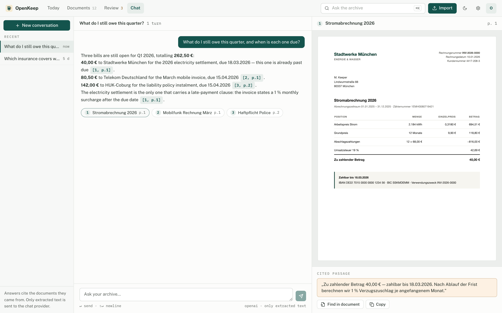
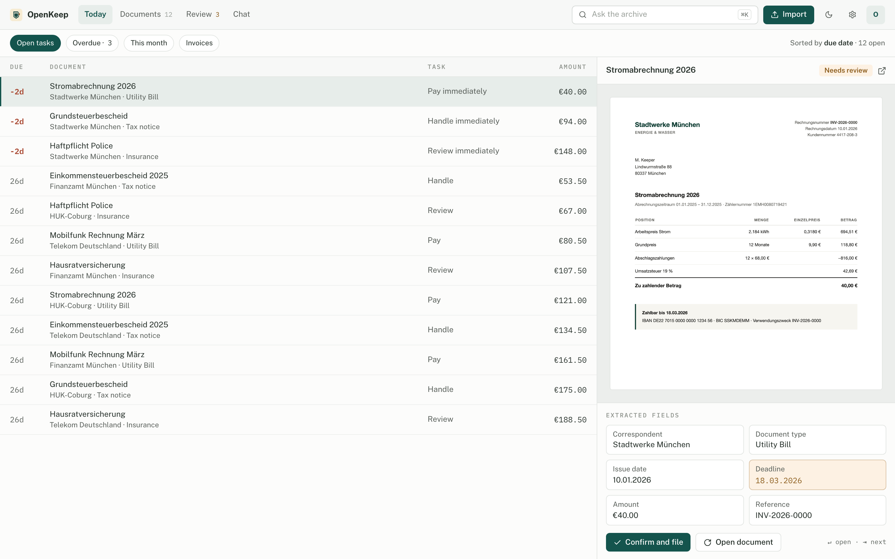
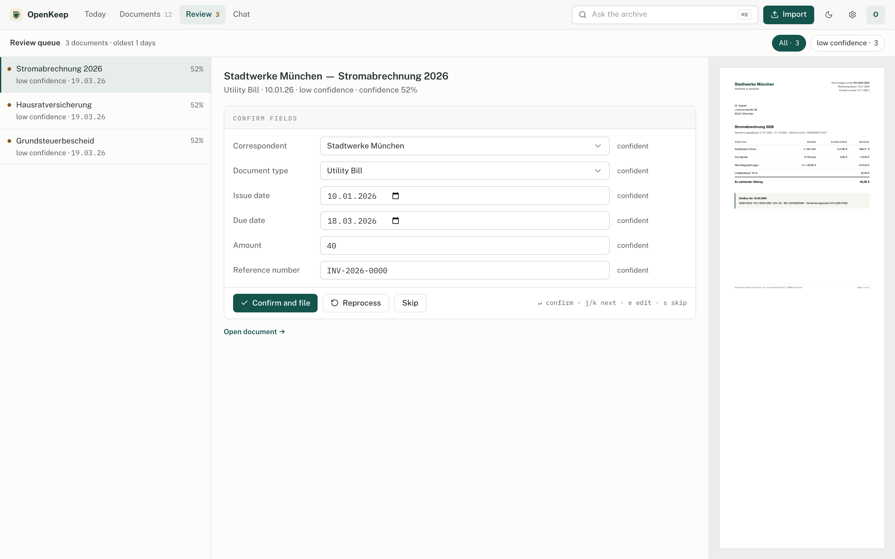
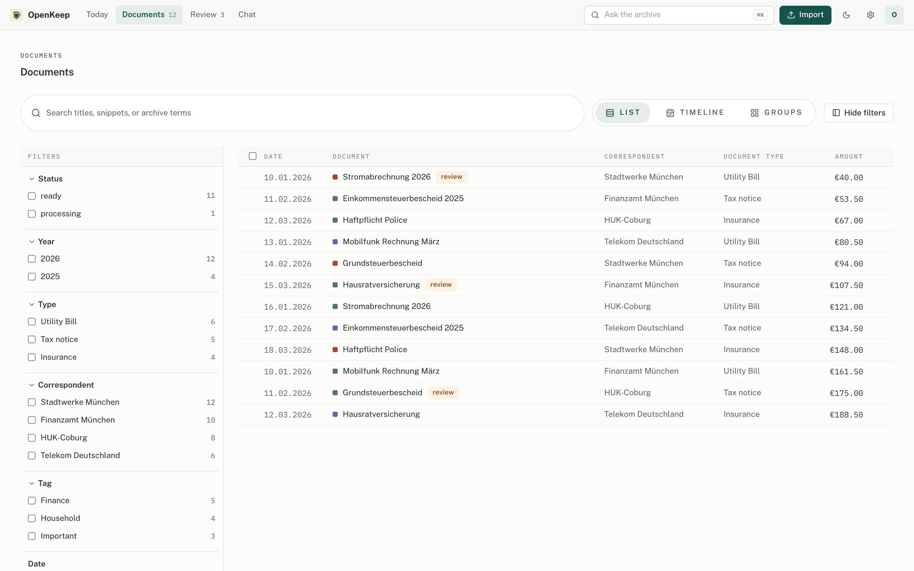
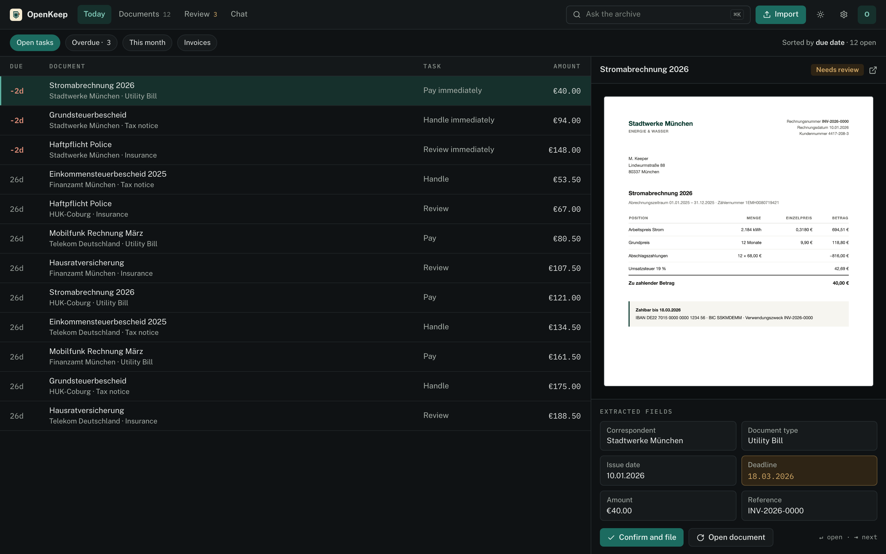
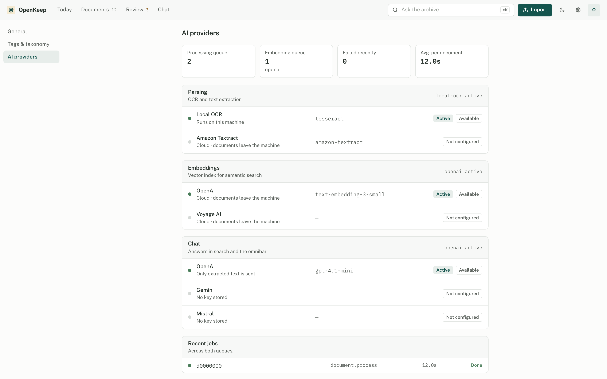

<p align="center">
  
</p>

<p align="center">
  <strong>Your paperwork, answered.</strong><br>
  A self-hosted document archive that reads your mail, tracks what is due, and answers questions with citations.
</p>

<p align="center">
  <a href="#quick-start">Quick start</a> ·
  <a href="#private-by-design">Privacy</a> ·
  <a href="#openkeep-vs-paperless-ngx">vs. paperless-ngx</a> ·
  <a href="docs/technical/architecture-overview.md">Architecture</a> ·
  <a href="docs/user/getting-started.md">Docs</a>
</p>

<p align="center">
  
</p>

---

Drop a scan in. OpenKeep OCRs it, works out who it is from, what type of document it
is, what it costs and when it is due, files it, and puts it on a deadline list. Then you
can ask the archive questions in plain language and get answers that cite the page they
came from.

It runs on your own machine. With the default configuration, no document ever leaves it.

## What you get

### A deadline queue instead of a folder tree

Today is a working list, not a dashboard: everything with an open deadline, soonest
first, with the extracted fields and the scan side by side so you can confirm and file
in one keystroke.



### Extraction you can correct — and a queue that asks

Every extracted field carries a confidence. Anything the pipeline is unsure about lands
in the review queue rather than quietly becoming wrong data. Corrections are stored as
manual overrides, so they survive reprocessing.



### Search that understands the archive

Full-text search, structured filters (year, correspondent, type, amount, tag, status)
and vector similarity run as one hybrid query. Facets are computed from the archive
itself, so browsing is a set of live filters rather than a folder hierarchy you have to
maintain.



### Answers with receipts

Ask across the whole archive. Answers are grounded in retrieved passages and every claim
links back to the document and page it came from — and when the evidence is not there,
OpenKeep says so instead of guessing.

### Everywhere you file paper

A web app, an Electron desktop client with workstation watch folders, and a React Native
mobile app that scans with the camera and keeps an encrypted offline copy of the archive.
All three follow the system theme.



## Private by design

Self-hosting is the starting point, not the whole story. The parts that matter:

| | |
| --- | --- |
| **Local OCR by default** | `ACTIVE_PARSE_PROVIDER=local-ocr` ships as the default: OCRmyPDF, Tesseract and Poppler run in your own worker container. Cloud parsing is opt-in per provider, and the settings screen labels every provider with whether documents leave the machine. |
| **AI is opt-in and text-only** | No embedding or chat provider is configured out of the box. When you do enable one, only extracted text is sent — never the original file — and the UI says so at the point of use. |
| **Single-owner auth** | Bcrypt password hashing, short-lived JWT access tokens, refresh tokens that are stored hashed, rotated on use and revoked as a family when a used one is replayed, optional TOTP two-factor with recovery codes, and request throttling in front of all of it. |
| **Owner-scoped queries** | Every document row carries an owner, and all user-facing query surfaces are scoped through a single filter builder. (See the [ownership model](docs/technical/architecture-overview.md#ownership-and-trust-boundaries) for what this does *not* yet cover.) |
| **A hardened desktop client** | Sandboxed renderer, context isolation, no node integration, a strict CSP, an allowlisted navigation policy and permission requests denied by default. An archive server can never hand the desktop client executable code. |
| **An encrypted mobile cache** | The offline copy on your phone is a SQLCipher database. The app verifies SQLCipher is actually compiled in before it opens anything, and refuses to run if it is not. |
| **Secrets kept out of the repo and the images** | `pnpm secrets:scan` runs gitleaks over the tracked tree and history, and the Docker build context excludes `.env*` by default. |



## OpenKeep vs. paperless-ngx

[paperless-ngx](https://github.com/paperless-ngx/paperless-ngx) is the reference
implementation of the self-hosted document archive, and OpenKeep starts from the same
premise: your paperwork belongs on your hardware. The difference is what happens after
a document is filed.

| | OpenKeep | paperless-ngx |
| --- | --- | --- |
| **Filing** | LLM-assisted extraction of correspondent, type, dates, amounts and references, with a deterministic fallback when no provider is configured | Rule-based matching plus a statistical auto-classifier, trained on your own corrections |
| **Confidence** | Per-field confidence; low-confidence documents are routed to a review queue before they are trusted | Matches are applied directly; your corrections retrain the classifier |
| **Asking questions** | Grounded Q&A across the archive with per-passage citations, built into the core product | Full-text and index-based search at the core; AI-assisted features are newer and optional |
| **Deadlines** | Due dates are a first-class field with a queue built on them | Custom fields and saved views |
| **OCR** | Local by default, with optional Google Document AI, AWS Textract, Azure Document Intelligence or Mistral OCR | Local (OCRmyPDF / Tesseract) |
| **Clients** | Web, Electron desktop, and a first-party mobile app with an encrypted offline archive | Web; mobile through community apps |
| **Stack** | One TypeScript monorepo — NestJS, React, React Native, Drizzle, PostgreSQL + pgvector | Python / Django with an Angular frontend |
| **License** | PolyForm Noncommercial 1.0.0 | GPLv3 |

**Where paperless-ngx is still the better choice.** It is years older, far more widely
deployed, and has an ecosystem of integrations and community mobile apps that OpenKeep
does not. Its GPLv3 license is more permissive than OpenKeep's, which is free for
personal and other noncommercial use but requires a commercial license for business use.
If you want the most proven option, take paperless-ngx. If you want the archive to do
the filing and answer questions about it, take OpenKeep.

## Quick start

Requires Docker and Node 22+ with pnpm.

```bash
git clone https://github.com/pauli2406/openkeep.git
cd openkeep
cp .env.example .env         # then replace the JWT secrets
pnpm install
pnpm docker:up               # postgres, minio, migrations, api, worker, docs
```

Open <http://localhost:3000> and complete the setup wizard — it creates the single owner
account. The stack is ready when `GET /api/health/ready` reports every check green.

That gets you a fully local archive: local OCR, no AI provider, nothing leaving the
machine. To turn on semantic search and answers, set `ACTIVE_EMBEDDING_PROVIDER` and
`ACTIVE_CHAT_PROVIDER` in `.env` — see the
[configuration reference](docs/operations/configuration-reference.md).

To run the API, worker and web app as separate processes instead, see
[running it locally](docs/technical/architecture-overview.md#running-it-locally).

## Documentation

| | |
| --- | --- |
| [Getting started](docs/user/getting-started.md) | Setup wizard, the main screens, day-to-day use |
| [Architecture overview](docs/technical/architecture-overview.md) | The whole system, layer by layer, with diagrams |
| [API and data flows](docs/technical/api-and-data-flows.md) | Endpoint surface and request lifecycles |
| [Deployment guide](docs/operations/deployment-guide.md) | Production hosting, backups, monitoring |
| [Documentation hub](docs/README.md) | Everything else |

The docs also render as a site: `pnpm docs:dev`.

## Contributing

```bash
pnpm typecheck            # all packages
pnpm test                 # unit tests
pnpm test:api:integration # requires Docker (Testcontainers)
pnpm secrets:scan         # gitleaks over tree and history
```

The full command list, including the OCR and live-provider suites, is in
[testing and validation](docs/technical/testing-and-validation.md).

The screenshots above are real renders of the production web bundle against a fixed demo
archive; regenerate them with `pnpm readme:shots`.

## License

OpenKeep is licensed under [PolyForm Noncommercial 1.0.0](LICENSE). Personal and other
noncommercial use is free. Commercial use — in a product, a service, or an internal
business offering — requires a separate commercial license; contact the project owner
before deploying it that way.
