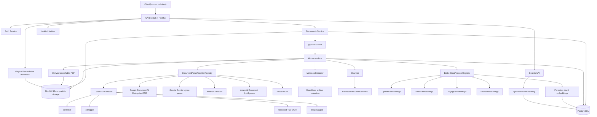

# Backend Notes

## Architecture Diagram

## Runtime Components

- API: receives uploads, exposes auth/search/archive endpoints, and enqueues processing jobs.
- Worker: consumes `document.process` and `document.embed` jobs from `pg-boss`, runs provider-selected parsing, shared archive extraction, chunk generation, embedding generation, and archive updates.
- PostgreSQL: stores users, documents, OCR text blocks, persisted chunks, chunk embeddings, processing jobs, tags, correspondents, document types, and audit events.
- MinIO: stores the original uploaded binary once per unique checksum plus derived searchable PDFs when parsing succeeds.

## Provider Wiring

- Parse provider interface: `DocumentParseProvider`
- Parse provider registry: `DocumentParseProviderRegistry`
- Active parse providers supported now:
  - `local-ocr`
  - `google-document-ai-enterprise-ocr`
  - `google-document-ai-gemini-layout-parser`
  - `amazon-textract`
  - `azure-ai-document-intelligence`
  - `mistral-ocr`
- Chunk generation interface: `Chunker`
- Active chunking implementation: `DeterministicChunker`
- Metadata extractor interface: `MetadataExtractor`
- Active metadata implementation: `HybridMetadataExtractor`
- The hybrid extractor still wraps `DeterministicMetadataExtractor` and keeps OpenKeep as the source of truth for archive fields.
- Embedding provider interface: `EmbeddingProvider`
- Embedding provider registry: `EmbeddingProviderRegistry`
- Active embedding providers supported now:
  - `openai`
  - `google-gemini`
  - `voyage`
  - `mistral`
- Answer provider interface exists but is currently backed by a no-op implementation.
- Config supports one globally active parse provider plus an optional fallback provider for hard failures.
- Config supports one globally active embedding provider and explicit model selection for semantic indexing.

## Processing Flow

1. Upload a PDF or image to `POST /api/documents`.
2. The API stores the original binary in object storage and inserts a `documents` row.
3. A `processing_jobs` record is inserted and published to `pg-boss`.
4. The worker selects the configured parse provider from the registry and optionally a fallback provider.
5. The active parse provider converts the source file into a normalized parsed-document model with text, pages, lines, blocks, optional tables, optional key-value pairs, optional chunk hints, and provider metadata.
6. Metadata extraction applies shared normalization for dates, currencies, amounts, correspondents, document types, confidence scoring, and review evidence.
7. Chunk generation derives deterministic stored chunks from normalized parse output and provider chunk hints when available.
8. If semantic indexing is configured, the worker enqueues a `document.embed` job after successful chunk persistence.
9. The embedding worker upserts chunk-level vectors keyed by document id, chunk index, provider, and model.
10. The document becomes searchable through PostgreSQL full-text search, structured filters, and the hybrid semantic endpoint.

## Parse Details

- Text uploads bypass OCR and are parsed directly.
- `local-ocr` uses `ocrmypdf` first for PDFs and falls back to Poppler plus `tesseract` when needed.
- `local-ocr` normalizes TIFF and HEIC/HEIF files to per-page PNGs with ImageMagick and then OCRs them with `tesseract`.
- `local-ocr` OCRs JPEG, PNG, and WebP files directly.
- Cloud adapters map provider-native output into the same normalized parse model:
  - Google Cloud Document AI Enterprise OCR
  - Google Cloud Document AI Gemini layout parser
  - Amazon Textract
  - Azure AI Document Intelligence
  - Mistral OCR
- Parsed output is persisted as full document text plus page/line blocks with bounding boxes.
- Parsed output may also carry tables, key-value pairs, provider chunk hints, warnings, and provider-native metadata.
- When parsing succeeds on a source that supports it, the worker stores a derived searchable PDF artifact separately from the original upload.

## Extraction Details

- Date normalization supports ISO, numeric, and textual month formats in English and German.
- Currency normalization maps common symbols and aliases like `€`, `eur`, `$`, and `usd`.
- Amount parsing handles decimal and thousands separator differences.
- Deterministic extraction currently derives:
  - correspondent from the first OCR lines
  - document type such as Invoice, Contract, Insurance, Tax, or Letter
  - issue date
  - due date
  - amount and currency
  - invoice/reference number
  - tags such as `finance`, `deadline`, `agreement`, `insurance`, `tax`, and `urgent`
- Confidence is computed from field evidence and OCR penalties, then compared against review thresholds.

## Chunking Details

- Chunk persistence is part of successful document processing.
- Each chunk stores document id, chunk index, text, page span, strategy version, a deterministic content hash, and provider-related metadata.
- The default chunker prefers provider chunk hints when available and falls back to deterministic grouping over normalized lines and pages.
- Reprocessing deletes and rebuilds chunk rows so chunk persistence stays idempotent.

## Embeddings and Semantic Search

- Semantic indexing stores embeddings per chunk, not per document.
- Embeddings are stored in `document_chunk_embeddings` with provider, model, dimensions, content hash, and vector payload.
- The active embedding provider is global in v1 and selected through config.
- `POST /api/search/semantic` applies structured filters first, then combines:
  - PostgreSQL full-text ranking
  - vector similarity over chunk embeddings
  - weighted reciprocal rank fusion
- Semantic responses stay document-centric and include matched chunks as explainability data.
- Embedding summary fields on documents include:
  - `embeddingStatus`
  - `embeddingProvider`
  - `embeddingModel`
  - `embeddingsStale`
  - `latestEmbeddingJob`
- Reindexing is exposed through:
  - `POST /api/embeddings/reindex`
  - `POST /api/documents/:id/reembed`

## Review and Operations

- Processing lifecycle status is limited to `pending`, `processing`, `ready`, and `failed`.
- Review state is persisted separately with `reviewStatus`, `reviewReasons`, `reviewedAt`, and `reviewNote`.
- Documents expose structured `metadata.reviewEvidence` so review callers can inspect missing invoice fields, OCR text length, thresholds, and active review reasons.
- Documents also expose `parseProvider`, `chunkCount`, embedding summaries, and provider-aware `metadata.parse` / `metadata.chunking` namespaces for future debugging and review UI.
- `GET /api/documents/review` returns the review queue.
- `POST /api/documents/:id/review/resolve` marks manual review complete.
- `POST /api/documents/:id/review/requeue` clears review state and publishes a fresh processing job.
- `GET /api/documents/:id/download/searchable` returns the derived searchable PDF when one exists.
- `GET /api/health` exposes provider configuration metadata including the active parse provider, active embedding provider, and available credential-backed capabilities.
- `GET /api/health/live`, `GET /api/health/ready`, and `GET /api/metrics` expose process health and runtime metrics.
- Metrics include processing outcomes, parse outcomes by provider, embedding outcomes by provider, durations, queue depth for both queues, pending-review gauges by reason, and stale-embedding gauges.

## Current API Surface

- Auth:
  - `POST /api/auth/setup`
  - `POST /api/auth/login`
  - `POST /api/auth/refresh`
  - `GET /api/auth/me`
  - `GET /api/auth/tokens`
  - `POST /api/auth/tokens`
  - `DELETE /api/auth/tokens/:id`
- Documents:
  - `POST /api/documents`
  - `GET /api/documents`
  - `GET /api/documents/facets`
  - `GET /api/documents/review`
  - `GET /api/documents/:id`
  - `GET /api/documents/:id/text`
  - `GET /api/documents/:id/download`
  - `GET /api/documents/:id/download/searchable`
  - `PATCH /api/documents/:id`
  - `POST /api/documents/:id/review/resolve`
  - `POST /api/documents/:id/review/requeue`
  - `POST /api/documents/:id/reprocess`
  - `POST /api/documents/:id/reembed`
- Embeddings:
  - `POST /api/embeddings/reindex`
- Search:
  - `GET /api/search/documents`
  - `POST /api/search/semantic`
- Ops:
  - `GET /api/health`
  - `GET /api/health/live`
  - `GET /api/health/ready`
  - `GET /api/metrics`

## Verification Paths

- `pnpm --filter @openkeep/api test:unit` runs pure Node unit coverage.
- `pnpm --filter @openkeep/api test:integration` runs the Testcontainers-backed API suite against PostgreSQL and MinIO.
- `pnpm --filter @openkeep/api test:ocr` runs OCR acceptance coverage and should be executed in a worker-capable environment with the same OCR binaries and Tesseract language data as the production worker image.
- `pnpm test:e2e:google`, `pnpm test:e2e:google:gemini`, `pnpm test:e2e:aws`, `pnpm test:e2e:azure`, and `pnpm test:e2e:mistral` run live parse-provider acceptance tests against configured cloud adapters.
- `pnpm test:e2e:openai-embeddings`, `pnpm test:e2e:gemini-embeddings`, `pnpm test:e2e:voyage`, and `pnpm test:e2e:mistral-embeddings` run live embedding-provider acceptance tests.
- Expected operator bootstrap path:
  1. bring up infrastructure
  2. run migrations
  3. start API and worker
  4. wait for readiness to go green

## Remaining Backend Gaps

- Answer generation is still not implemented.
- Retrieval evaluation is present in test coverage but not yet exposed as a dedicated operator-facing benchmark command.
- Web, mobile, and desktop clients are still future phases on top of this backend.
