# Architecture Overview

This is the map of the system: every layer, what it owns, and where it hands off.
The specialised documents linked at each turn go deeper; this one exists so that
the shape is legible before you open any of them.

- **[Layer map](#layer-map)** — the whole system on one page
- **[Repository layout](#repository-layout)** — packages and their dependency rules
- **[Client layer](#client-layer)** — web, desktop, mobile
- **[API layer](#api-layer)** — NestJS modules and the request lifecycle
- **[Processing layer](#processing-layer)** — the ingestion pipeline
- **[Intelligence layer](#intelligence-layer)** — extraction, retrieval, answers
- **[Data layer](#data-layer)** — schema and object storage
- **[Provider layer](#provider-layer)** — the pluggable outside world
- **[Ownership and trust boundaries](#ownership-and-trust-boundaries)**
- **[Deployment topology](#deployment-topology)**
- **[Running it locally](#running-it-locally)**

## Layer map

Everything below is one of these six layers. Requests flow down; nothing in a
lower layer calls back up.

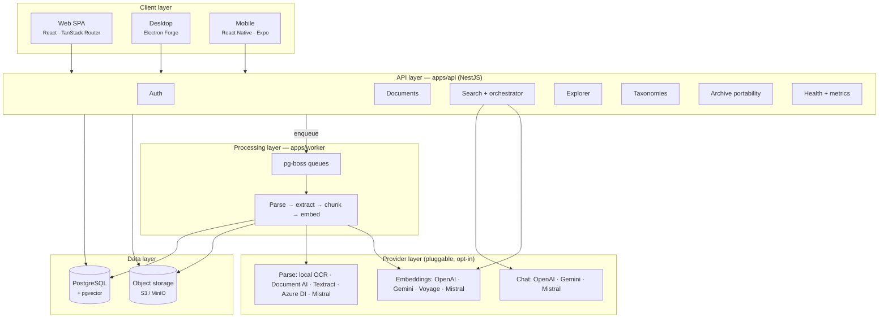

The API and the worker are separate processes over a shared database. The queue
is a table in that same PostgreSQL instance (`pg-boss`), so a deployment needs
no broker: Postgres, an S3-compatible bucket, and the two Node processes.

## Repository layout

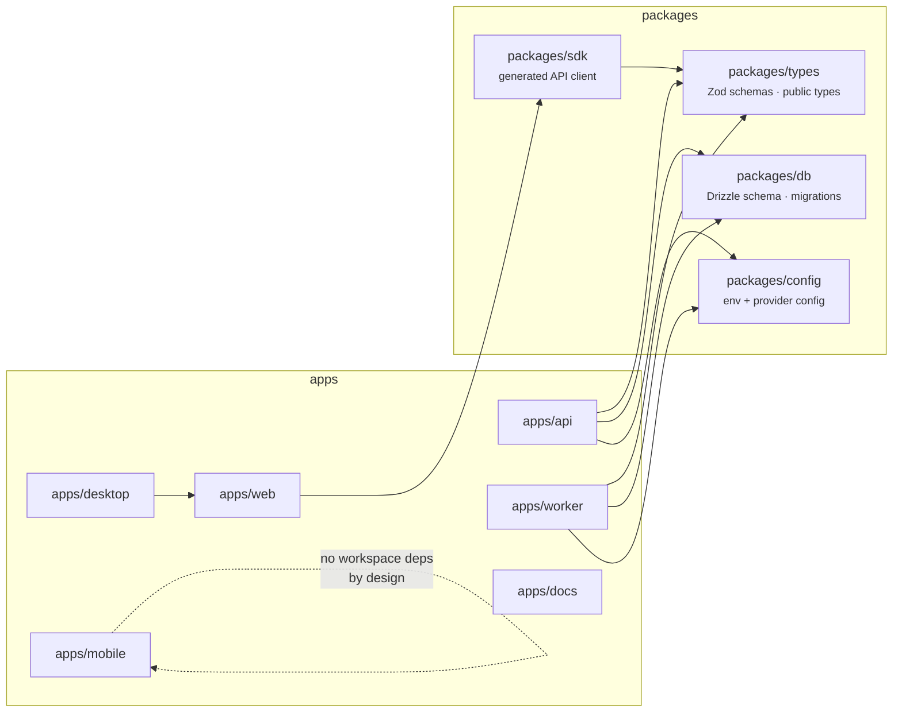

| Package | Owns |
| --- | --- |
| `apps/api` | NestJS REST API, auth, orchestration, SPA hosting in production builds |
| `apps/worker` | Queue consumer: OCR/parse, extraction, chunking, embeddings, searchable PDFs |
| `apps/web` | The React SPA, and the shared UI the desktop client runs |
| `apps/desktop` | Electron main process: archive profiles, watch folders, the hardened window |
| `apps/mobile` | Expo client with a camera scanner and an encrypted offline archive |
| `apps/docs` | Docusaurus renderer over this `docs/` directory |
| `packages/types` | Zod schemas and public types — the contract between all of the above |
| `packages/sdk` | Typed client generated from the OpenAPI document |
| `packages/db` | Drizzle schema and migrations |
| `packages/config` | Environment parsing and provider configuration |

### Module formats are load-bearing

`packages/types` and `packages/sdk` are consumed by both a CommonJS runtime (the
API and worker) and a browser bundler (the web app), so both build **dual CJS +
ESM** and declare an `exports` map with `require` and `import` conditions.

This is correctness, not tidiness. `packages/sdk` re-exports the types package,
and the web app imports the SDK at runtime — so a CJS-only types build reaches
the browser through that re-export and fails with `ReferenceError: module is not
defined`, even though the web app itself only imports types *as types*. Vite
serves linked workspace packages as source rather than pre-bundling them, so
nothing converts the CJS on the way through.

**Rule:** any new package the web app can reach, directly or through a
re-export, has to build ESM too. `packages/config` and `packages/db` are
CJS-only because only Node runtimes consume them.

## Client layer

Three clients, one API contract. They share the archive-wide endpoints and the
SSE answer-stream format; they do not share a session.

| | Web | Desktop | Mobile |
| --- | --- | --- | --- |
| Runtime | Browser SPA | Electron, running the shared web UI | React Native (Expo) |
| Routing | TanStack Router | Same, behind `openkeep://app` | Expo Router |
| Offline | — | Cached documents | Full encrypted archive copy |
| Distinctive | — | Multiple archive profiles, workstation watch folders, native save | Camera scanning, SQLCipher cache |

The desktop main process owns the network boundary: the renderer never talks to
an archive server directly, and an archive server can never supply executable
renderer code. See [Desktop Application](./desktop-application.md#security-invariants).

The mobile app deliberately has **no workspace package dependencies** — it keeps
local copies of the SSE parser and citation linkifier rather than importing
`@openkeep/sdk`, so its native build never depends on the workspace build graph.
See [Mobile Document Cache](./mobile-offline-sync.md).

## API layer

`apps/api` is a NestJS application. Modules map to the surfaces in
[API and Data Flows](./api-and-data-flows.md).

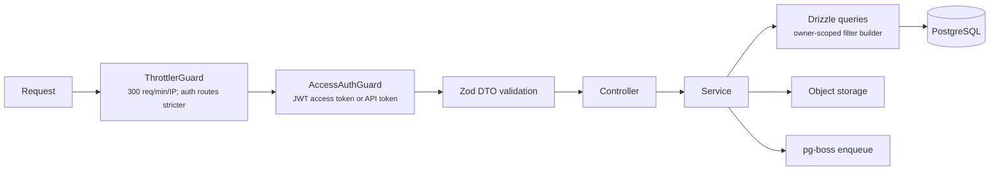

In production-style builds the API also serves the built web SPA, so a
single-container deployment is one origin with no CORS surface.

### Authentication

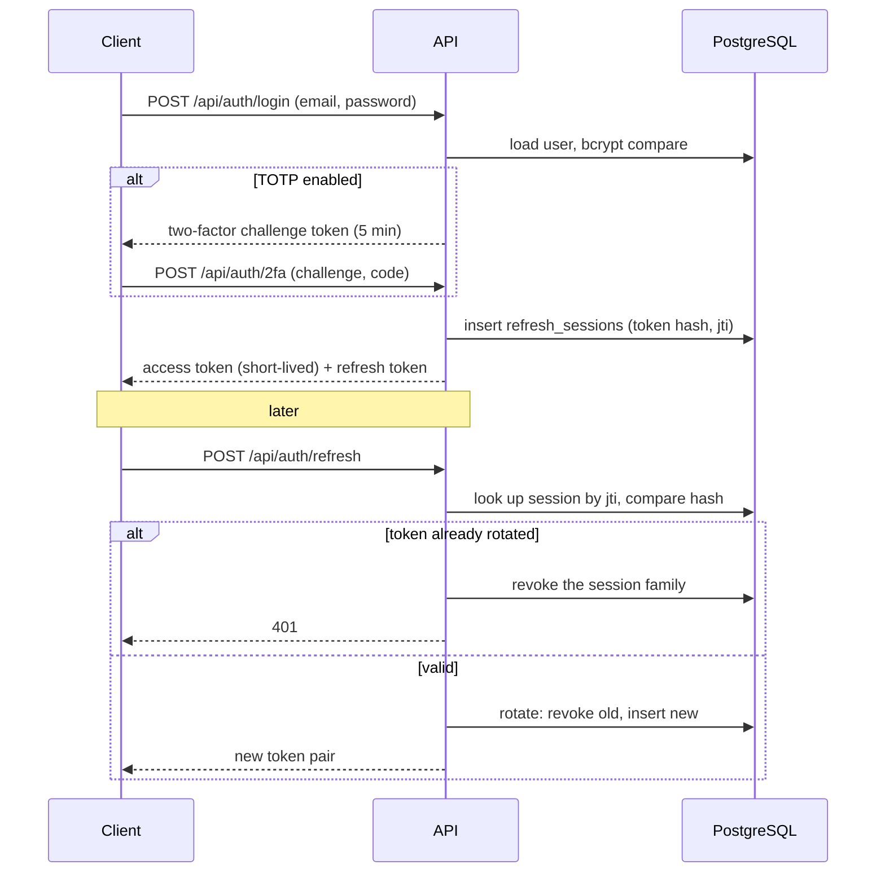

Refresh tokens are stored hashed, rotated on every use, and a replayed token
revokes the family rather than being silently accepted. Long-lived API tokens
exist for automation and are checked by the same guard. TOTP enrolment is gated
behind a short-lived enrolment token and issues recovery codes.

## Processing layer

Ingestion is asynchronous end to end. The upload request returns as soon as the
binary is stored and the row exists; everything after that is queue work.

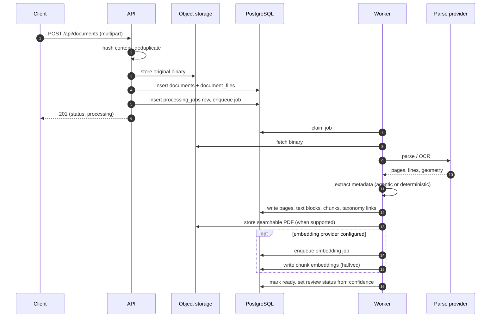

Retries are bounded with `pg-boss` backoff; the worker emits structured JSON
logs, and `documents.latestProcessingJob` surfaces the last attempt (including
its error) to the UI rather than hiding failures in a log file.

**Processing status and review status are separate axes.** Processing status
tracks pipeline execution; review status tracks whether a human should look. A
document can be technically `ready` and still be queued for review because a
field came back below the confidence threshold.

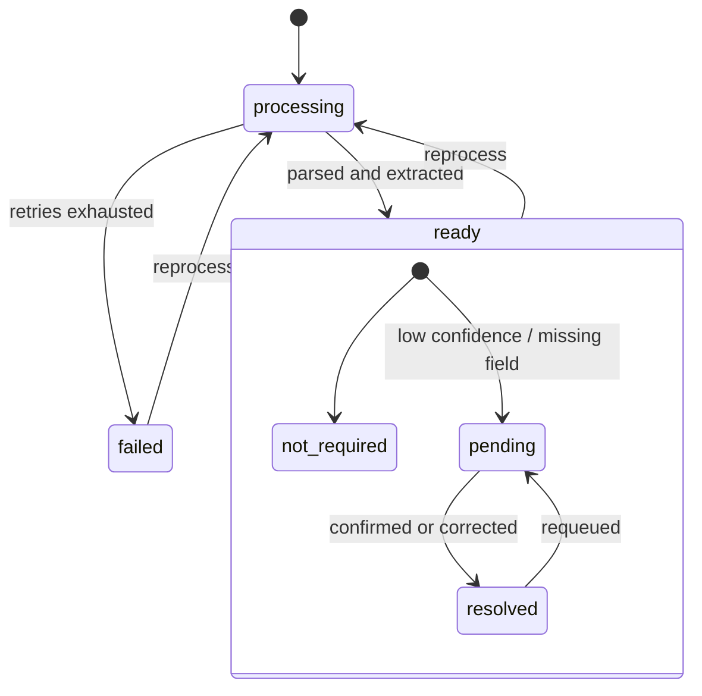

Corrections made in review are persisted as **manual overrides**, so a later
reprocess does not overwrite a human decision with a fresh guess.

## Intelligence layer

### Extraction

The entry point is `HybridMetadataExtractor`. It routes to a LangGraph agentic
pipeline when at least one LLM provider is configured, and to a deterministic
rule-based extractor when none is — the archive stays fully functional with no
AI provider at all, it just extracts less.

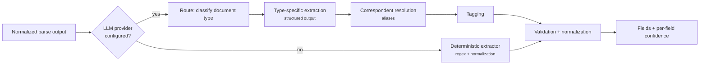

Details, including the supported document types and the structured-output
contract, are in [Agentic Document Intelligence](./agentic-document-intelligence.md).

### Retrieval and answers

Archive-wide questions pass through a search orchestrator before anything runs.
Not every question is a retrieval question: "what is pending review?" is a
database query, and answering it from retrieved prose would be both slower and
less correct.

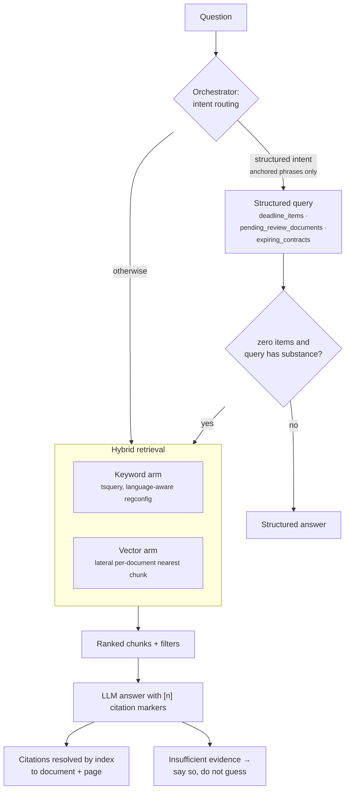

Two properties worth knowing before you touch this code:

- The vector arm ranks **documents by their nearest chunk** using a lateral
  probe over the composite primary key. Every eligible document is considered
  exactly once, so a 400-page file cannot crowd the results with its own chunks.
  The result is exact, not approximate.
- Citations are resolved by **excerpt index**, not by fuzzy title matching. The
  model cites `[1]`, the payload carries a matching `index`, and the client
  resolves it exactly.

Answers stream over SSE (`search-results` → `answer-token` → `done` / `error`).
The scaling limits that were deliberately deferred — ANN pre-filters, partial
HNSW indexes, a generated tsvector column, rerankers — and the threshold at
which to revisit them, are recorded in
[API and Data Flows](./api-and-data-flows.md#search-surface).

## Data layer

### PostgreSQL

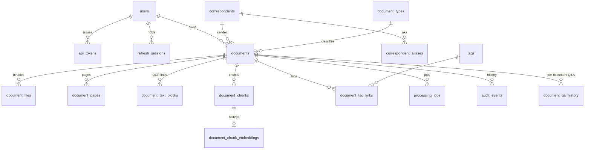

Notes that matter when reading queries:

- Embeddings live in `document_chunk_embeddings` as pgvector `halfvec`, keyed by
  the chunk's composite primary key. Provider and model are stored alongside, so
  a provider switch marks vectors stale rather than silently mixing spaces.
- `document_text_blocks.bounding_box` is **nullable**. Providers that return no
  line geometry (Mistral OCR returns markdown per page) store `null` instead of
  fabricated boxes; real geometry returns only on reprocessing with a
  geometry-capable provider.
- `documents.metadata.parse.providerMetadata` holds a bounded summary of the
  provider response — model, pages processed, size — never the raw OCR payload.
- `audit_events` is the document history surface: upload, review, reprocess,
  reembed, and metadata changes.

### Object storage

An S3-compatible bucket (MinIO in the default compose stack) holds original
uploads, addressed by content hash, and derived searchable PDFs. Nothing in the
database depends on the bucket being reachable to *list* an archive — only to
open a file — so a storage outage degrades rather than breaks the app.

## Provider layer

Every external model is behind a registry with one active provider and, for
parsing, an optional fallback. Switching one is configuration, not code.

| Category | Providers | Default |
| --- | --- | --- |
| Parse | `local-ocr`, `google-document-ai-enterprise-ocr`, `google-document-ai-gemini-layout-parser`, `amazon-textract`, `azure-ai-document-intelligence`, `mistral-ocr` | `local-ocr` |
| Embeddings | `openai`, `google-gemini`, `voyage`, `mistral` | none — semantic indexing is off |
| Chat | `openai`, `gemini`, `mistral` | none — answers are off |

The local parse path is a full pipeline, not a stub: OCRmyPDF, Tesseract with
German and English language data, Poppler and ImageMagick ship in the worker
image, with normalization for scanned PDFs, TIFF, HEIC/HEIF and direct raster
uploads.

Because the defaults are "local parse, no AI", a fresh install processes
documents without any credential and without any network egress. Enabling a
cloud provider is an explicit act, and the settings UI labels each provider with
whether documents leave the machine.

## Ownership and trust boundaries

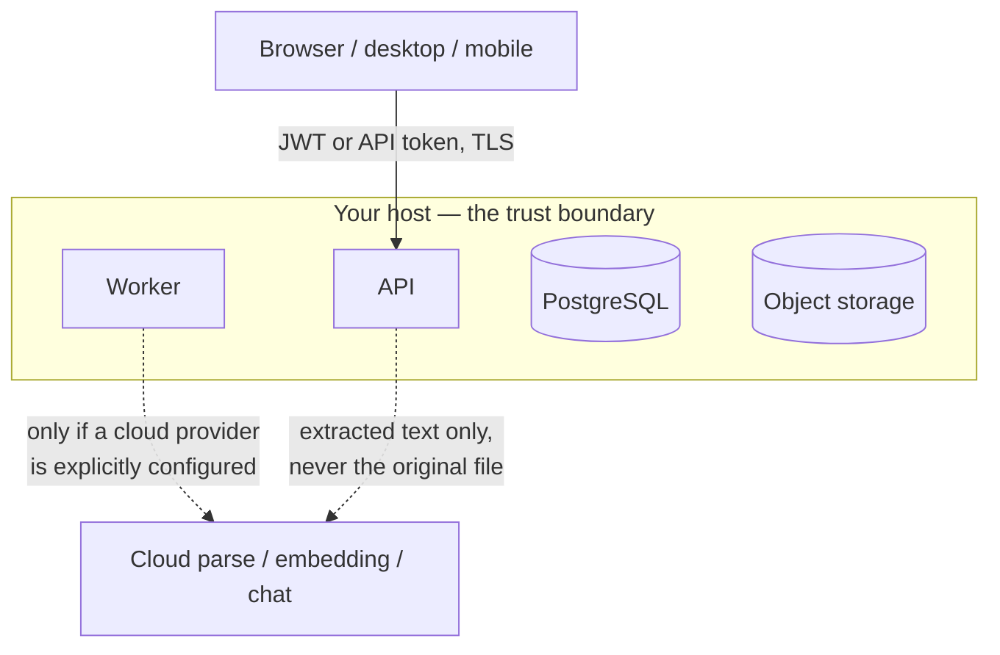

OpenKeep is a **single-owner** system today, and the ownership model reflects
exactly that — no more:

- every document row carries an indexed `owner_user_id`;
- all user-facing query surfaces are owner-scoped through one filter builder,
  `buildDocumentFilterQuery(filters, ownerUserId)` in
  `apps/api/src/documents/documents.service.ts` — listing, keyword search,
  semantic search, answer and stream paths, and the per-document Q&A chunk
  queries;
- **background jobs** (explorer aggregation, correspondent intelligence)
  deliberately run unscoped: they operate on the whole single-owner archive and
  execute without an authenticated principal.

> **Limitation, stated plainly.** This is defence in depth for a single-owner
> design, not a multi-tenancy model. Before a second user can exist, the
> unscoped background surfaces and the taxonomy/facet queries have to be made
> owner-aware. Do not read the current state as sufficient isolation for a
> multi-user deployment.

Client-side boundaries are documented where they are enforced: the desktop
[security invariants](./desktop-application.md#security-invariants) and the
mobile [encrypted cache](./mobile-offline-sync.md).

## Deployment topology

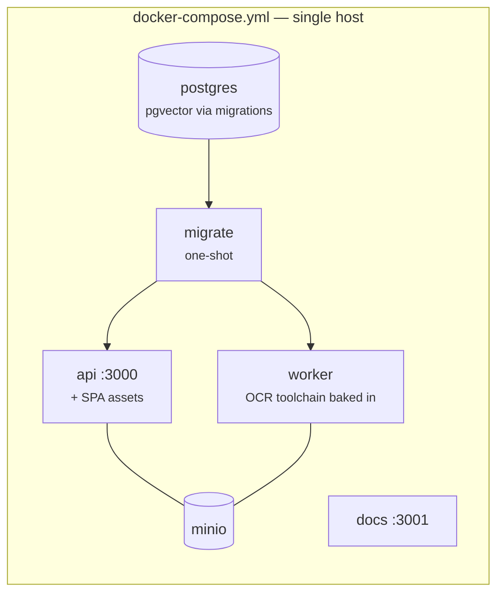

The boot order is `postgres → migrate → api/worker`; the docs service is
independent. `pnpm docker:up` wraps compose and builds the shared `worker-base`
OCR image first if it is missing locally.

Production hosting, backups, restore and monitoring are covered in
[Operations](../operations/README.md) — start with the
[deployment guide](../operations/deployment-guide.md).

## Running it locally

For the containerised stack, `pnpm docker:up` is the whole story. To run the
processes directly:

```bash
cp .env.example .env                    # replace the JWT secrets
pnpm install
docker compose up -d postgres minio     # infrastructure only
pnpm db:migrate
pnpm --filter @openkeep/api dev
pnpm --filter @openkeep/worker dev
pnpm --filter @openkeep/web dev
```

Wait for `GET /api/health/ready` to report every check green before using the
stack. `pnpm docs:dev` runs this documentation as a site on port 3001.

Keep real credentials only in untracked local env files. The Docker build
context excludes `.env*` by default while still allowing tracked `*.example`
templates into images, and `pnpm secrets:scan` runs gitleaks over the tracked
tree and its history. If real credentials ever sat in a local `.env` before that
protection existed, rotate them before publishing images.

Optional docs-site search (Typesense) and the provider-specific live test suites
have their own setup steps — see
[Testing and Validation](./testing-and-validation.md) and the
[configuration reference](../operations/configuration-reference.md).

## Related documents

- [API and Data Flows](./api-and-data-flows.md)
- [Agentic Document Intelligence](./agentic-document-intelligence.md)
- [Web Application](./web-application.md)
- [Desktop Application](./desktop-application.md)
- [Mobile Document Cache](./mobile-offline-sync.md)
- [Testing and Validation](./testing-and-validation.md)
- [Deployment Guide](../operations/deployment-guide.md)
- [Backend Notes](../backend.md)
